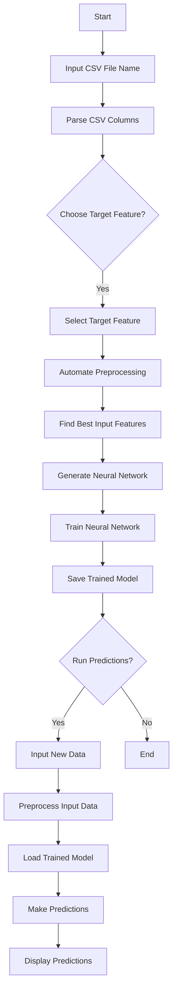
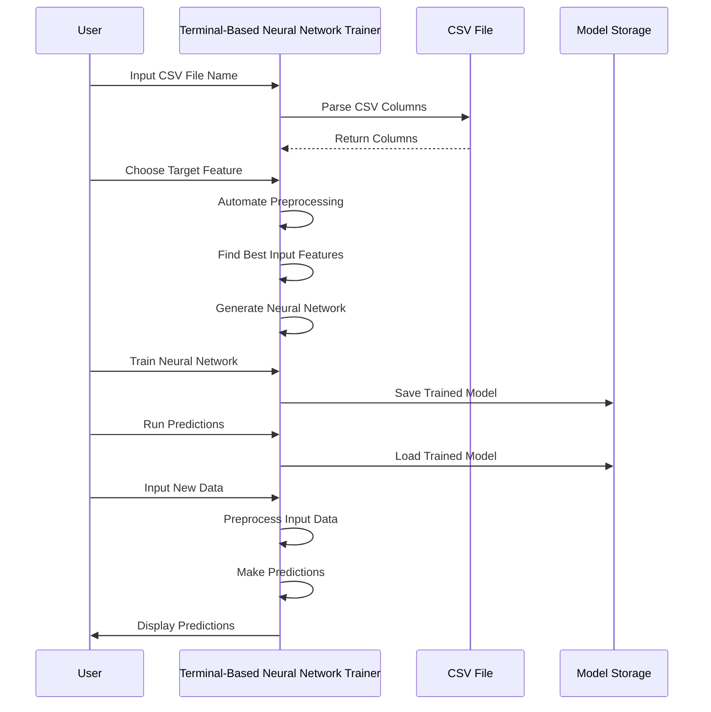
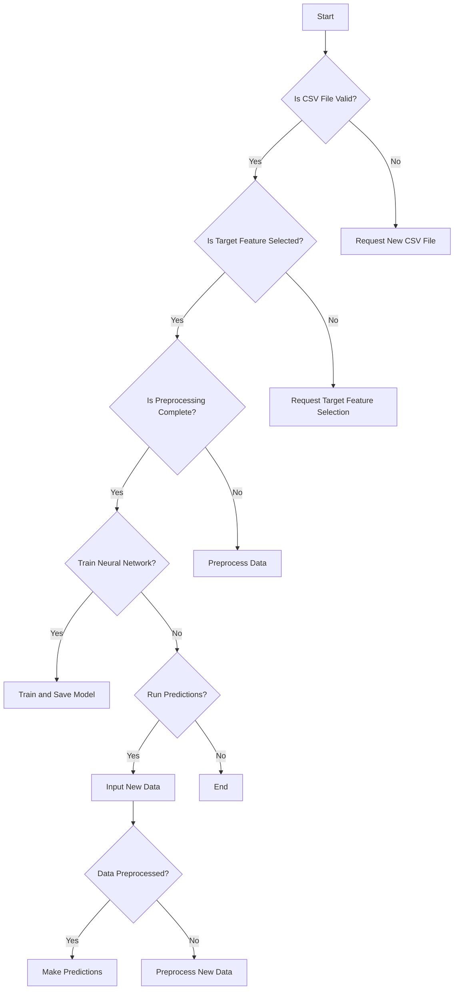
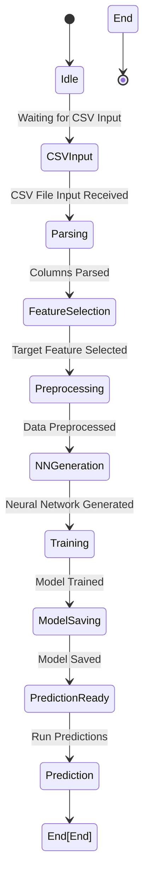

# Technical Diagrams

## User Flow Diagram

## System Sequence Diagram

## Decision Tree

## State Diagram

This set of diagrams provides a comprehensive visualization of the terminal-based Python application for training and deploying neural networks using CSV data. Each diagram covers different aspects of the system, ensuring clarity and understanding of user interactions, system sequences, decision points, and state transitions.