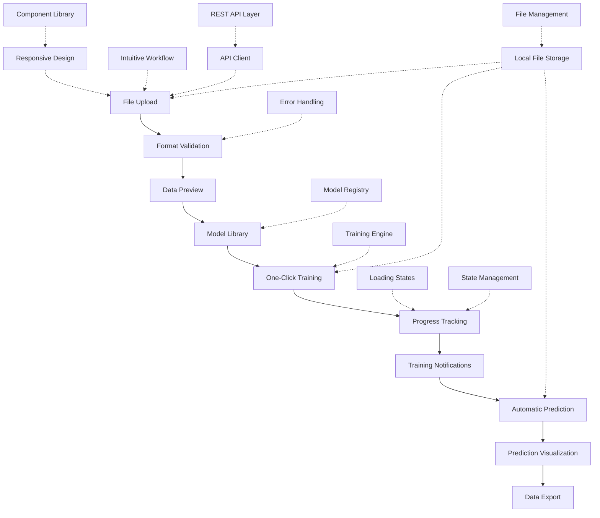
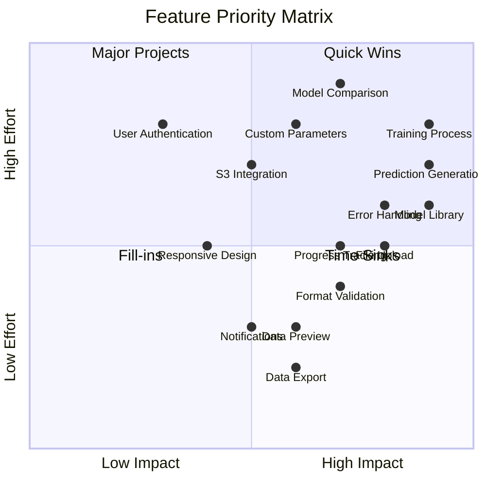

# Feature Specification Document

## Neural Network Training Platform

### 1. Core Features

#### 1.1 Data Upload and Validation

| Feature ID | Name | Description | Priority | User Stories |
|------------|------|-------------|----------|-------------|
| F1.1 | File Upload | Allow users to upload CSV data files through drag-and-drop or file browser | Must Have | US1, US3 |
| F1.2 | Format Validation | Validate uploaded files for correct format, structure, and data types | Must Have | US3 |
| F1.3 | Data Preview | Show preview of uploaded data with column names and sample rows | Must Have | US2 |
| F1.4 | Error Reporting | Provide clear error messages for invalid or problematic data files | Must Have | US3 |
| F1.5 | Large File Handling | Support for larger datasets with progress indicators and chunked processing | Should Have | - |
| F1.6 | Data Mapping | Allow users to map columns in their data to required model inputs | Could Have | - |

**Technical Implementation:**
- Frontend component for file upload with drag-and-drop functionality
- Backend API endpoint for receiving and processing files
- File validation service to check format and structure
- Data preview generation with sampling of large files
- Error handling with specific feedback on data issues

#### 1.2 Model Selection

| Feature ID | Name | Description | Priority | User Stories |
|------------|------|-------------|----------|-------------|
| F2.1 | Model Library | Provide selection of pre-configured neural network models for different use cases | Must Have | US4, US5 |
| F2.2 | Model Description | Display descriptions of each model's purpose, requirements, and outputs | Must Have | US5 |
| F2.3 | Use Case Matching | Suggest appropriate models based on uploaded data characteristics | Should Have | - |
| F2.4 | Technical Details | Show technical details of model architecture for advanced users | Could Have | US6 |
| F2.5 | Custom Parameters | Allow limited customization of model parameters (future enhancement) | Won't Have (MVP) | US23 |

**Technical Implementation:**
- Model registry with metadata about each available model
- Selection interface with visual distinction between model types
- Description component with collapsible technical details
- Backend service to match data characteristics to suitable models

#### 1.3 Training Process

| Feature ID | Name | Description | Priority | User Stories |
|------------|------|-------------|----------|-------------|
| F3.1 | One-Click Training | Enable users to start training with a single action after model selection | Must Have | US7 |
| F3.2 | Progress Tracking | Display training progress with percentage complete and time estimates | Must Have | US8 |
| F3.3 | Training Notifications | Notify users when training completes or encounters errors | Must Have | US9 |
| F3.4 | Background Processing | Allow training to continue in background while users perform other tasks | Should Have | - |
| F3.5 | Training Parameters | Display key metrics during training process (loss, accuracy, etc.) | Could Have | - |
| F3.6 | Training Abort | Allow users to cancel ongoing training process | Could Have | - |

**Technical Implementation:**
- Frontend training controller with progress updates
- Backend training engine with TensorFlow/Keras integration
- WebSocket or polling mechanism for real-time progress updates
- Notification system for training status changes
- Background job processing for training tasks

#### 1.4 Prediction Generation

| Feature ID | Name | Description | Priority | User Stories |
|------------|------|-------------|----------|-------------|
| F4.1 | Automatic Prediction | Generate predictions automatically after successful training | Must Have | US10 |
| F4.2 | Prediction Visualization | Visualize prediction results with appropriate charts and graphs | Must Have | US12 |
| F4.3 | Data Export | Allow export of prediction results in CSV format | Must Have | US11 |
| F4.4 | Prediction Explanation | Provide basic explanation of prediction results and their interpretation | Should Have | - |
| F4.5 | Comparative Analysis | Compare predictions with historical data or alternative models | Could Have | US21 |
| F4.6 | Confidence Intervals | Display confidence levels or ranges for predictions | Won't Have (MVP) | - |

**Technical Implementation:**
- Prediction engine integrated with trained models
- Visualization library for rendering prediction charts
- Export functionality with data formatting
- Documentation components for result interpretation
- Statistical analysis for prediction quality assessment

### 2. Supporting Features

#### 2.1 User Interface

| Feature ID | Name | Description | Priority | User Stories |
|------------|------|-------------|----------|-------------|
| S1.1 | Responsive Design | Ensure UI works well on desktop and tablet devices | Must Have | - |
| S1.2 | Intuitive Workflow | Guide users through logical process from upload to results | Must Have | - |
| S1.3 | Loading States | Provide visual feedback during processing operations | Must Have | - |
| S1.4 | Error Handling | Display user-friendly error messages with recovery actions | Must Have | - |
| S1.5 | Help Tooltips | Offer contextual help information throughout the interface | Should Have | - |
| S1.6 | Dark/Light Modes | Support different UI themes for user preference | Won't Have (MVP) | - |

**Technical Implementation:**
- React components with responsive design principles
- Workflow wizard or stepper component
- Loading state indicators and spinners
- Error boundary components with friendly messaging
- Context-sensitive help system

#### 2.2 Data Storage and Management

| Feature ID | Name | Description | Priority | User Stories |
|------------|------|-------------|----------|-------------|
| S2.1 | Local File Storage | Store uploaded data, models, and predictions in local file system | Must Have | US16 |
| S2.2 | Data Cleanup | Remove temporary files and unused data automatically | Should Have | - |
| S2.3 | S3 Integration | Prepare for future migration to S3 storage (not in MVP) | Won't Have (MVP) | US18 |
| S2.4 | Data Versioning | Track different versions of datasets and models | Won't Have (MVP) | - |
| S2.5 | Data Encryption | Encrypt sensitive data at rest | Won't Have (MVP) | - |

**Technical Implementation:**
- File system service for local storage operations
- Cleanup jobs for temporary data management
- Abstraction layer to facilitate future cloud storage integration
- Naming conventions and metadata for tracking data assets

### 3. Future Features (Post-MVP)

#### 3.1 User Management

| Feature ID | Name | Description | Priority | User Stories |
|------------|------|-------------|----------|-------------|
| F1.1 | User Authentication | Allow users to create accounts and authenticate | Future | US22 |
| F1.2 | Project Management | Enable users to organize work into projects | Future | - |
| F1.3 | User Roles | Support different permission levels for team collaboration | Future | - |
| F1.4 | Activity History | Track user actions and model training history | Future | - |

#### 3.2 Advanced Model Features

| Feature ID | Name | Description | Priority | User Stories |
|------------|------|-------------|----------|-------------|
| F2.1 | Custom Model Parameters | Allow users to adjust model hyperparameters | Future | US23 |
| F2.2 | Model Comparison | Train and compare multiple models side-by-side | Future | US21 |
| F2.3 | Scheduled Retraining | Set up automatic retraining with new data | Future | US24 |
| F2.4 | Model Explainability | Provide insights into feature importance and model decisions | Future | - |

#### 3.3 Integration and API

| Feature ID | Name | Description | Priority | User Stories |
|------------|------|-------------|----------|-------------|
| F3.1 | REST API | Provide programmatic access to platform capabilities | Future | US25 |
| F3.2 | Webhooks | Allow notifications to external systems on events | Future | - |
| F3.3 | Data Source Connectors | Connect directly to data warehouses or databases | Future | - |
| F3.4 | Export Integrations | Push predictions to BI tools or business systems | Future | - |

### 4. Technical Architecture Features

#### 4.1 Frontend Architecture

| Feature ID | Name | Description | Priority | User Stories |
|------------|------|-------------|----------|-------------|
| T1.1 | Component Library | Reusable UI components for consistent experience | Must Have | - |
| T1.2 | State Management | Centralized state management for application data | Must Have | - |
| T1.3 | API Client | Service layer for communication with backend | Must Have | US19 |
| T1.4 | Error Boundary | Global error handling for frontend stability | Should Have | - |
| T1.5 | Analytics Integration | Usage tracking for feature optimization | Won't Have (MVP) | - |

#### 4.2 Backend Architecture

| Feature ID | Name | Description | Priority | User Stories |
|------------|------|-------------|----------|-------------|
| T2.1 | REST API Layer | Endpoints for frontend communication | Must Have | US19 |
| T2.2 | Model Registry | System for managing available neural network models | Must Have | US17 |
| T2.3 | Training Engine | Service for executing neural network training | Must Have | - |
| T2.4 | File Management | Service for handling file operations | Must Have | US16 |
| T2.5 | Async Processing | Background job processing for long-running tasks | Should Have | - |
| T2.6 | Logging Framework | Comprehensive logging for debugging and auditing | Should Have | - |
| T2.7 | Error Handling | Robust error handling and reporting | Should Have | - |
| T2.8 | Caching Layer | Performance optimization through caching | Could Have | - |

**Technical Implementation:**
- Flask/FastAPI for REST API development
- TensorFlow/Keras for neural network implementation
- Background task queue for async processing
- Structured logging with severity levels
- Global exception handling with custom error types
- Redis or in-memory caching for performance

#### 4.3 Infrastructure and DevOps

| Feature ID | Name | Description | Priority | User Stories |
|------------|------|-------------|----------|-------------|
| T3.1 | Local Development | Setup for local development environment | Must Have | - |
| T3.2 | Docker Support | Containerization for consistent deployment | Should Have | - |
| T3.3 | Configuration Management | Environment-specific configuration handling | Should Have | - |
| T3.4 | Monitoring Setup | Basic system health monitoring | Could Have | - |
| T3.5 | CI/CD Pipeline | Automated testing and deployment | Won't Have (MVP) | - |
| T3.6 | Cloud Deployment | Infrastructure for cloud deployment | Won't Have (MVP) | - |

**Technical Implementation:**
- Docker and Docker Compose for containerization
- Environment-based configuration system
- Health check endpoints for monitoring
- GitHub Actions or Jenkins for future CI/CD

### 5. Implementation Phases

#### 5.1 Phase 1: MVP Core Features

- Data upload and validation (F1.1-F1.4)
- Basic model selection (F2.1-F2.2)
- One-click training with progress (F3.1-F3.3)
- Automatic prediction generation (F4.1-F4.3)
- Essential UI components (S1.1-S1.4)
- Local file storage (S2.1)
- Core technical architecture (T1.1-T1.3, T2.1-T2.4, T3.1)

#### 5.2 Phase 2: Enhanced Features

- Improved data handling (F1.5-F1.6)
- Advanced model features (F2.3-F2.4)
- Enhanced training capabilities (F3.4-F3.6)
- Better prediction insights (F4.4-F4.5)
- UI enhancements (S1.5)
- Improved data management (S2.2)
- Technical improvements (T1.4, T2.5-T2.7, T3.2-T3.3)

#### 5.3 Phase 3: Future Expansion

- User management features (F1.1-F1.4)
- Advanced model features (F2.1-F2.4)
- Integration capabilities (F3.1-F3.4)
- Cloud storage integration (S2.3-S2.5)
- Remaining technical features (T1.5, T2.8, T3.4-T3.6)

### 6. Feature Dependencies

### 7. Feature Prioritization Matrix

