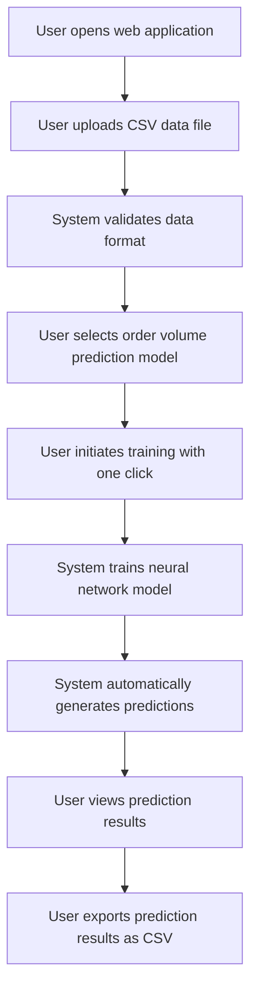

# MVP Outline Document

## Neural Network Training Platform - Minimum Viable Product

### 1. MVP Overview

The Minimum Viable Product (MVP) for the Neural Network Training Platform will deliver the essential functionality needed to demonstrate the core value proposition: enabling users to upload data, select a neural network model, train it, and generate predictions without requiring machine learning expertise. The MVP will run locally with file system storage and support one use case (order volume prediction) as a proof of concept.

### 2. MVP Scope

#### 2.1 In Scope

- User interface for data upload and model selection
- Backend processing for data validation and model training
- Order volume prediction neural network implementation
- Basic results visualization
- Local deployment with file system storage
- Minimal error handling and validation

#### 2.2 Out of Scope for MVP

- Cloud storage integration (S3)
- User authentication and account management
- Multiple concurrent training jobs
- Advanced customization options for models
- Multiple use cases beyond order volume prediction
- Scheduled retraining and batch processing
- API for programmatic access

### 3. User Journey

The MVP will support the following user journey:

### 4. Technical Implementation

#### 4.1 Frontend Implementation

- **Technology**: React with TypeScript
- **Key Components**:
  - File upload component with drag-and-drop support
  - Model selection interface (simplified for MVP with one option)
  - Training progress indicator
  - Basic data visualization for predictions
  - Export functionality for results

#### 4.2 Backend Implementation

- **Technology**: Python with Flask
- **Key Components**:
  - API endpoints for file upload, training, and results retrieval
  - Data validation and preprocessing module
  - Neural network model implementation using TensorFlow/Keras
  - Training execution engine
  - Prediction generation module
  - Local file system handler

#### 4.3 Data Storage

- **Technology**: Local file system
- **Storage Requirements**:
  - Uploaded CSV files
  - Trained model weights and parameters
  - Generated prediction data
  - Configuration files

#### 4.4 Neural Network Implementation

- **Order Volume Prediction Model**:
  - Predefined architecture suitable for time series prediction
  - Automated feature selection based on CSV headers
  - Standardized preprocessing steps
  - Configurable training parameters with sensible defaults
  - Output format optimized for business interpretation

### 5. MVP Features in Detail

#### 5.1 Data Upload

- **Description**: Enable users to upload CSV files containing their data.
- **Implementation Details**:
  - File upload component with progress indicator
  - Basic validation for file format and size
  - Preview of uploaded data with column identification
  - Error messaging for invalid files

#### 5.2 Model Selection

- **Description**: Allow users to select the order volume prediction model type.
- **Implementation Details**:
  - Simple selection interface (single option for MVP)
  - Brief description of the model and its purpose
  - Indication of required data format

#### 5.3 Training Initiation

- **Description**: Provide one-click training start with status updates.
- **Implementation Details**:
  - Simple "Train Model" button
  - Progress indicator showing training status
  - Basic error handling for training failures
  - Notification upon training completion

#### 5.4 Automated Prediction Generation

- **Description**: Automatically generate predictions after successful training.
- **Implementation Details**:
  - Prediction for next 6 months of order volume
  - Per carrier per lane predictions (based on data structure)
  - Storage of prediction results in local file system

#### 5.5 Results Visualization

- **Description**: Display prediction results in an easily understandable format.
- **Implementation Details**:
  - Line chart showing predicted vs. historical values
  - Basic tabular display of numerical results
  - Simple filtering options for data exploration

#### 5.6 Results Export

- **Description**: Allow users to download prediction results as CSV.
- **Implementation Details**:
  - Export button generating CSV file
  - Properly formatted output for business use
  - Download functionality in browser

### 6. Development Timeline

| Phase | Task | Duration |
|-------|------|----------|
| 1 | Project setup and environment configuration | 1 week |
| 2 | Frontend development - UI components | 2 weeks |
| 3 | Backend API development | 2 weeks |
| 4 | Neural network implementation for order volume | 2 weeks |
| 5 | Data handling and local storage | 1 week |
| 6 | Integration and end-to-end testing | 1 week |
| 7 | Bug fixes and refinement | 1 week |

**Total MVP Development Time**: 10 weeks

### 7. MVP Success Criteria

The MVP will be considered successful if it achieves the following:

- Users can successfully upload CSV data files
- The system can train an order volume prediction model
- Predictions are generated automatically after training
- Results can be visualized and exported
- The entire process can be completed without technical assistance

### 8. Post-MVP Priorities

After successful MVP deployment, the following features will be prioritized:

1. S3 bucket integration for data and model storage
2. Addition of a second neural network model use case
3. Enhanced data visualization and analysis tools
4. Improved error handling and user guidance
5. Performance optimizations for larger datasets

### 9. MVP Testing Plan

#### 9.1 Functional Testing

- Data upload functionality with various file formats
- Training process with sample datasets
- Prediction generation accuracy
- Results visualization and export

#### 9.2 Usability Testing

- Navigation flow and UI intuitiveness
- Error message clarity
- Results interpretation ease
- Overall user experience assessment

#### 9.3 Performance Testing

- Upload handling for various file sizes
- Training performance with different dataset sizes
- Application responsiveness during processing
- Resource utilization during model training

### 10. MVP Technical Limitations

- Limited to processing datasets that fit in local memory
- Single user operation (no concurrent users)
- Training time dependent on local hardware capabilities
- Limited to CSV data format with specific structure
- Single use case implementation (order volume prediction)
- No persistent user profiles or saved history

### 11. MVP Documentation

The following documentation will be delivered with the MVP:

- User guide with step-by-step instructions
- Input data format specifications
- Explanation of prediction results
- Troubleshooting guide for common issues
- Developer documentation for future enhancements