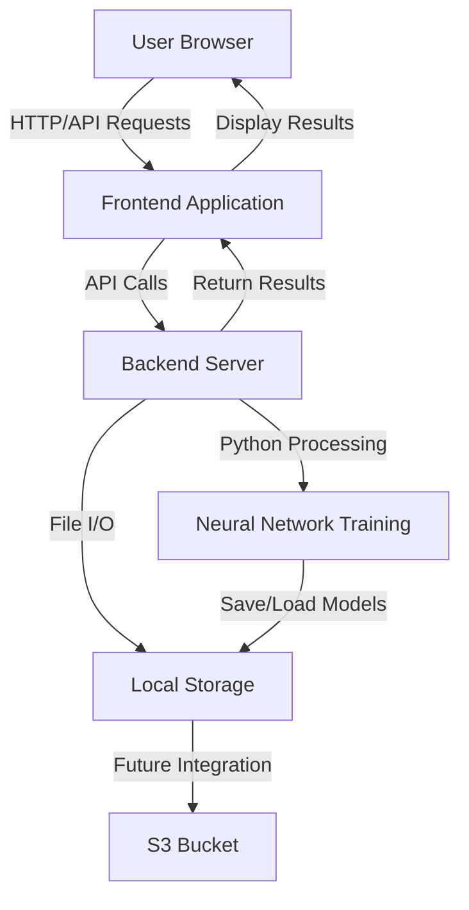
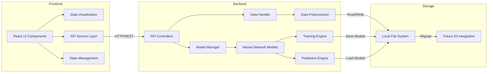

# System Design Document

## Neural Network Training Platform

### 1. System Overview

The Neural Network Training Platform is a web-based application that enables users to upload data, select a neural network model type, and train it automatically without requiring machine learning expertise. The system is designed to be use-case agnostic, initially supporting order volume predictions but expandable to multiple neural network applications.

### 2. Architecture

#### 2.1 High-Level Architecture

#### 2.2 Component Architecture

### 3. Component Descriptions

#### 3.1 Frontend Components

- **React UI Components**: Provides user interface for data upload, model selection, and results display.
- **Data Visualization**: Renders charts and graphs for prediction results.
- **API Service Layer**: Handles communication with backend services.
- **State Management**: Manages application state and user session data.

#### 3.2 Backend Components

- **API Controllers**: Exposes endpoints for frontend communication.
- **Model Manager**: Manages available neural network model types and configurations.
- **Data Handler**: Processes uploaded files and manages data storage.
- **Data Preprocessor**: Prepares raw data for neural network training.
- **Neural Network Models**: Contains model definitions for different use cases.
- **Training Engine**: Executes model training process.
- **Prediction Engine**: Generates predictions from trained models.

#### 3.3 Storage Components

- **Local File System**: Stores uploaded data, trained models, and generated predictions in the MVP.
- **Future S3 Integration**: Cloud storage for scalability in future releases.

### 4. Data Flow

#### 4.1 Data Upload Flow

1. User uploads CSV file through UI
2. Frontend sends file to backend API
3. Backend validates file format
4. Data Handler saves file to local storage
5. Backend returns confirmation and data preview to frontend
6. Frontend displays data preview to user

#### 4.2 Model Training Flow

1. User selects model type and initiates training
2. Frontend sends training request to backend API
3. Backend loads data file from local storage
4. Data Preprocessor prepares data for training
5. Model Manager creates appropriate neural network model
6. Training Engine executes training process
7. Trained model is saved to local storage
8. Training status and completion notification sent to frontend
9. Frontend displays training results to user

#### 4.3 Prediction Generation Flow

1. After successful training, backend automatically initiates prediction process
2. Prediction Engine loads trained model
3. Engine generates predictions for future periods
4. Predictions saved to local storage
5. Backend sends prediction results to frontend
6. Frontend visualizes predictions for user

### 5. API Design

#### 5.1 Frontend-Backend API Endpoints

| Endpoint | Method | Description | Request Body | Response |
|----------|--------|-------------|--------------|----------|
| `/api/data/upload` | POST | Upload data file | File data | Upload confirmation, file ID |
| `/api/data/preview/{fileId}` | GET | Get data preview | None | Column names, sample rows |
| `/api/models/list` | GET | List available models | None | Array of model types and descriptions |
| `/api/models/train` | POST | Start model training | File ID, model type | Training job ID, initial status |
| `/api/training/status/{jobId}` | GET | Check training status | None | Progress percentage, status |
| `/api/training/result/{jobId}` | GET | Get training results | None | Model metrics, model ID |
| `/api/predictions/generate` | POST | Generate predictions | Model ID, parameters | Prediction job ID |
| `/api/predictions/result/{jobId}` | GET | Get prediction results | None | Prediction data, visualization data |
| `/api/files/export/{fileId}` | GET | Export results to CSV | None | CSV file download |

### 6. Technology Stack

#### 6.1 Frontend Technologies

- **Framework**: React with TypeScript
- **UI Components**: Material-UI or Ant Design
- **State Management**: Redux or Context API
- **Data Visualization**: Recharts or D3.js
- **API Communication**: Axios or Fetch API
- **Build Tools**: Webpack, Babel

#### 6.2 Backend Technologies

- **Language**: Python
- **Web Framework**: Flask or FastAPI
- **Neural Network Library**: TensorFlow with Keras
- **Data Processing**: Pandas, NumPy
- **File Handling**: Python standard libraries
- **API Documentation**: Swagger/OpenAPI

#### 6.3 DevOps & Infrastructure

- **Version Control**: Git/GitHub
- **Local Development**: Docker containers
- **Future Cloud Storage**: AWS S3
- **Future Deployment**: Docker containers, AWS/Azure

### 7. Security Considerations

- Input validation to prevent malicious file uploads
- Data sanitization for all API inputs
- Rate limiting for API endpoints
- Secure file handling and storage
- Future: Authentication and authorization system
- Future: Encryption for sensitive data

### 8. Scalability Considerations

- Modular design for adding new neural network model types
- Separation of frontend and backend for independent scaling
- Preparation for cloud storage migration
- Design for eventual containerization
- Asynchronous processing for long-running training jobs

### 9. Monitoring and Logging

- Frontend error tracking
- Backend application logging
- Training process monitoring
- System resource utilization metrics
- User action audit logs

### 10. Development and Deployment Plan

#### 10.1 Development Phases

1. **Phase 1 - MVP**
   - Local development environment setup
   - Basic frontend for data upload and model selection
   - Backend API with file handling
   - Order volume prediction model implementation
   - Local file storage

2. **Phase 2 - Enhanced Features**
   - Improved UI/UX
   - Additional model types
   - Advanced data visualization
   - Performance optimizations
   
3. **Phase 3 - Cloud Integration**
   - S3 bucket integration
   - User authentication
   - Enhanced security features
   - API for programmatic access

#### 10.2 Deployment Strategy

1. **MVP Deployment**: Local deployment for initial testing
2. **Production Deployment**: Containerized application with cloud storage integration
3. **CI/CD Pipeline**: Automated testing and deployment for future releases

### 11. Risks and Mitigations

| Risk | Impact | Probability | Mitigation |
|------|--------|------------|------------|
| Performance bottlenecks during training | High | Medium | Implement asynchronous processing, optimize algorithms |
| Data format incompatibility | Medium | High | Robust validation, clear error messages, format documentation |
| Scalability limitations with local storage | Medium | Medium | Design for easy migration to cloud storage |
| Security vulnerabilities | High | Low | Implement thorough input validation, follow security best practices |
| Browser compatibility issues | Medium | Medium | Use modern frameworks with polyfills, cross-browser testing |