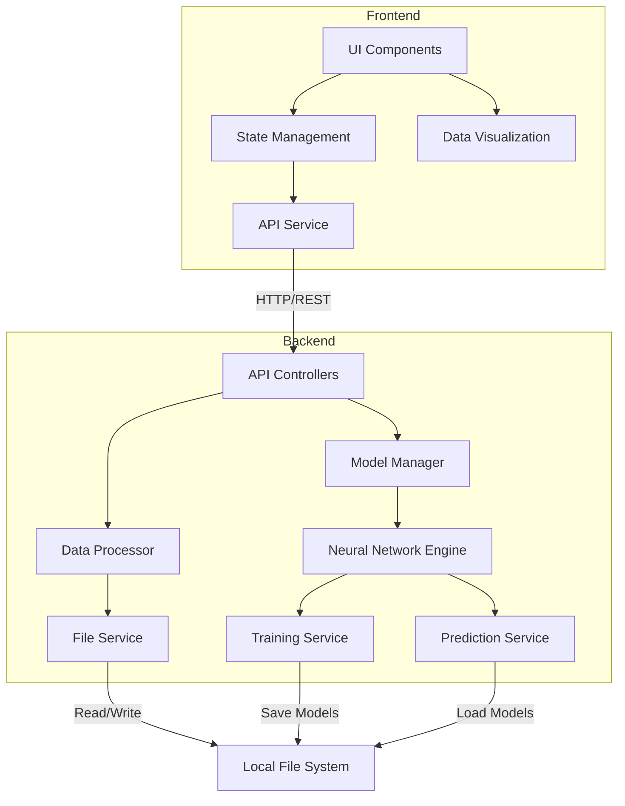
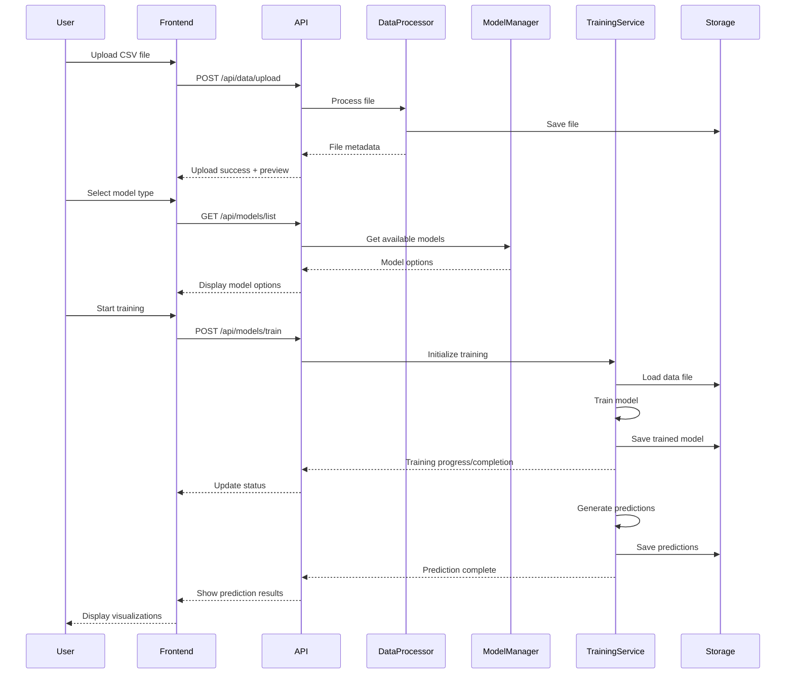

# Technical Approach Document

## Neural Network Training Platform

### 1. Overview

This document outlines the technical approach for implementing the Neural Network Training Platform, a web-based application that enables users to upload data, select pre-configured neural network models, and generate predictions without requiring machine learning expertise. The platform is designed to be use-case agnostic, with order volume prediction serving as the initial implementation.

### 2. Technology Stack Selection

#### 2.1 Frontend Technology

**Selected Technology: React with TypeScript**

**Rationale:**
- Strong component-based architecture supports the modular UI requirements
- TypeScript provides type safety and better development experience
- Rich ecosystem of libraries for data visualization and file handling
- Widespread community support and well-established best practices
- Good performance for interactive web applications

**Alternatives Considered:**
- Angular: More opinionated but heavier framework
- Vue.js: Lighter weight but smaller ecosystem for complex data visualization
- Plain JavaScript: Less structured and more prone to errors

#### 2.2 Backend Technology

**Selected Technology: Python with Flask/FastAPI**

**Rationale:**
- Python is the de facto language for machine learning and neural networks
- Direct integration with TensorFlow/Keras without language barriers
- FastAPI provides modern, high-performance API development
- Simple deployment model suitable for MVP
- Strong data processing capabilities with Pandas and NumPy

**Alternatives Considered:**
- Node.js: Would require TensorFlow.js with potential performance limitations
- Java/Spring: More complex deployment, less natural fit for ML
- Go: Fast but less mature ML ecosystem

#### 2.3 Neural Network Framework

**Selected Technology: TensorFlow with Keras**

**Rationale:**
- Industry standard with extensive documentation and examples
- High-level Keras API simplifies neural network implementation
- Excellent support for different neural network architectures
- Good performance on CPU for MVP phase
- Easy model serialization and loading

**Alternatives Considered:**
- PyTorch: More flexible but slightly steeper learning curve
- Scikit-learn: Simpler but less powerful for complex neural networks
- TensorFlow.js: Browser-based but performance concerns for training

#### 2.4 Data Processing

**Selected Technology: Pandas & NumPy**

**Rationale:**
- Standard tools for data manipulation in Python
- Excellent CSV parsing and preprocessing capabilities
- Well-integrated with machine learning workflows
- Efficient handling of tabular data

**Alternatives Considered:**
- Raw Python: Less efficient for tabular data
- Dask: Overcomplicated for MVP requirements
- PySpark: Too heavyweight for local processing

### 3. System Architecture Design

#### 3.1 Component Architecture



#### 3.2 Component Responsibilities

**Frontend Components:**
- **UI Components**: Handles user interface rendering and interactions
- **State Management**: Manages application state and data flow
- **API Service**: Communicates with backend services
- **Data Visualization**: Renders charts and graphs for results

**Backend Components:**
- **API Controllers**: Exposes endpoints for frontend communication
- **Data Processor**: Handles data validation, parsing, and preprocessing
- **Model Manager**: Manages available neural network configurations
- **File Service**: Manages file system operations
- **Neural Network Engine**: Core ML functionality
- **Training Service**: Executes model training process
- **Prediction Service**: Generates predictions from trained models

#### 3.3 Data Flow Architecture



### 4. Technical Implementation Approach

#### 4.1 Frontend Implementation

**React Component Structure:**
```
/src
  /components
    /layout
      Header.tsx
      Footer.tsx
      MainLayout.tsx
    /upload
      FileUploader.tsx
      DataPreview.tsx
    /models
      ModelSelector.tsx
      ModelDetails.tsx
    /training
      TrainingController.tsx
      ProgressIndicator.tsx
    /results
      PredictionChart.tsx
      DataTable.tsx
      ExportButton.tsx
  /services
    api.service.ts
    file.service.ts
    training.service.ts
  /hooks
    useFileUpload.ts
    useTraining.ts
    usePredictions.ts
  /store
    dataSlice.ts
    trainingSlice.ts
    resultsSlice.ts
  /utils
    formatters.ts
    validators.ts
  App.tsx
  index.tsx
```

**State Management:**
- Redux or Context API for global state management
- State slices for different functional areas
- Thunks or custom hooks for async operations

**API Communication:**
- Axios for HTTP requests
- Request interceptors for error handling
- Response transformers for data normalization
- Polling or WebSockets for real-time updates

**UI Components:**
- Material-UI or Ant Design for component library
- Responsive grid system for layout
- Form components with built-in validation
- Loading indicators and error messages
- Modal dialogs for confirmations and alerts

**Data Visualization:**
- Recharts for interactive charts and graphs
- Custom visualization components for specific use cases
- Data tables with sorting and filtering
- CSV export functionality

#### 4.2 Backend Implementation

**API Structure:**
```
/app
  /api
    __init__.py
    data.py
    models.py
    training.py
    predictions.py
  /services
    __init__.py
    file_service.py
    data_processor.py
    model_manager.py
    training_service.py
    prediction_service.py
  /models
    __init__.py
    base_model.py
    order_volume_model.py
    # future models here
  /utils
    __init__.py
    validators.py
    formatters.py
    file_helpers.py
  /config
    __init__.py
    settings.py
  main.py
```

**API Endpoints:**
```python
# Example FastAPI implementation
from fastapi import FastAPI, UploadFile, File, HTTPException, BackgroundTasks
from pydantic import BaseModel
import services

app = FastAPI()

@app.post("/api/data/upload")
async def upload_file(file: UploadFile = File(...)):
    try:
        result = await services.file_service.save_file(file)
        preview = services.data_processor.generate_preview(result.file_path)
        return {"status": "success", "file_id": result.file_id, "preview": preview}
    except Exception as e:
        raise HTTPException(status_code=400, detail=str(e))

@app.get("/api/models/list")
async def list_models():
    return services.model_manager.get_available_models()

@app.post("/api/models/train")
async def train_model(request: TrainingRequest, background_tasks: BackgroundTasks):
    job_id = services.training_service.create_job(request.file_id, request.model_type)
    background_tasks.add_task(services.training_service.run_training, job_id)
    return {"status": "started", "job_id": job_id}

@app.get("/api/training/status/{job_id}")
async def get_training_status(job_id: str):
    return services.training_service.get_job_status(job_id)

@app.get("/api/predictions/result/{job_id}")
async def get_prediction_results(job_id: str):
    return services.prediction_service.get_results(job_id)
```

**Neural Network Implementation:**
```python
# Example base model class
class BaseNeuralNetworkModel:
    def __init__(self, config=None):
        self.model = None
        self.config = config or {}
        self.preprocessing_pipeline = None
        
    def build_model(self, input_shape, output_shape):
        """Build the neural network architecture"""
        raise NotImplementedError
        
    def preprocess_data(self, data):
        """Preprocess input data for training or prediction"""
        raise NotImplementedError
        
    def train(self, X, y, validation_split=0.2, epochs=100, batch_size=32):
        """Train the neural network model"""
        if self.model is None:
            input_shape = X.shape[1]
            output_shape = 1 if len(np.unique(y)) <= 2 else len(np.unique(y))
            self.build_model(input_shape, output_shape)
            
        history = self.model.fit(
            X, y,
            epochs=epochs,
            batch_size=batch_size,
            validation_split=validation_split,
            callbacks=[
                tf.keras.callbacks.EarlyStopping(patience=10),
                tf.keras.callbacks.ModelCheckpoint('best_model.h5')
            ]
        )
        return history
        
    def predict(self, X):
        """Generate predictions"""
        return self.model.predict(X)
        
    def save(self, path):
        """Save the model and preprocessing pipeline"""
        self.model.save(f"{path}/model.h5")
        with open(f"{path}/preprocessor.pkl", 'wb') as f:
            pickle.dump(self.preprocessing_pipeline, f)
            
    @classmethod
    def load(cls, path):
        """Load a saved model and preprocessor"""
        instance = cls()
        instance.model = tf.keras.models.load_model(f"{path}/model.h5")
        with open(f"{path}/preprocessor.pkl", 'rb') as f:
            instance.preprocessing_pipeline = pickle.load(f)
        return instance
```

**Order Volume Prediction Model:**
```python
# Example specific model implementation
class OrderVolumeModel(BaseNeuralNetworkModel):
    def build_model(self, input_shape, output_shape):
        """Build LSTM model for time series prediction"""
        self.model = tf.keras.Sequential([
            tf.keras.layers.InputLayer(input_shape=(input_shape,)),
            tf.keras.layers.Reshape((-1, 1)) if input_shape > 1 else tf.keras.layers.Reshape((1, 1)),
            tf.keras.layers.LSTM(64, return_sequences=True),
            tf.keras.layers.Dropout(0.2),
            tf.keras.layers.LSTM(32),
            tf.keras.layers.Dropout(0.2),
            tf.keras.layers.Dense(16, activation='relu'),
            tf.keras.layers.Dense(output_shape)
        ])
        
        self.model.compile(
            optimizer=tf.keras.optimizers.Adam(learning_rate=0.001),
            loss='mse',
            metrics=['mae']
        )
        
        return self.model
        
    def preprocess_data(self, data):
        """Preprocess time series data for order volume prediction"""
        # Create sequences for time series prediction
        # Implementation would depend on exact data format
        # This is a simplified example
        
        from sklearn.preprocessing import StandardScaler
        from sklearn.pipeline import Pipeline
        from sklearn.impute import SimpleImputer
        
        # Create preprocessing pipeline
        self.preprocessing_pipeline = Pipeline([
            ('imputer', SimpleImputer(strategy='mean')),
            ('scaler', StandardScaler())
        ])
        
        # Apply preprocessing
        processed_data = self.preprocessing_pipeline.fit_transform(data)
        
        # Create sequences for LSTM
        X, y = create_sequences(processed_data, sequence_length=6)
        
        return X, y
        
    def generate_future_predictions(self, data, periods=6):
        """Generate predictions for future periods"""
        # Implementation would generate predictions for next 6 months
        # This is a simplified example
        
        latest_data = data[-6:]  # Use last 6 data points
        predictions = []
        
        # Generate predictions one by one
        current_sequence = latest_data
        for _ in range(periods):
            # Reshape for prediction
            pred_input = current_sequence.reshape(1, -1)
            # Preprocess
            pred_input = self.preprocessing_pipeline.transform(pred_input)
            # Predict next value
            next_pred = self.model.predict(pred_input)
            # Append to predictions
            predictions.append(next_pred[0, 0])
            # Update sequence
            current_sequence = np.roll(current_sequence, -1)
            current_sequence[-1] = next_pred
            
        return predictions
```

**File Service Implementation:**
```python
# Example file service
class FileService:
    def __init__(self, storage_path="./storage"):
        self.storage_path = storage_path
        os.makedirs(storage_path, exist_ok=True)
        
    async def save_file(self, file):
        """Save uploaded file to storage"""
        file_id = str(uuid.uuid4())
        file_path = os.path.join(self.storage_path, f"{file_id}.csv")
        
        # Create file
        with open(file_path, 'wb') as f:
            content = await file.read()
            f.write(content)
            
        return {"file_id": file_id, "file_path": file_path}
        
    def get_file_path(self, file_id):
        """Get path for a file by ID"""
        return os.path.join(self.storage_path, f"{file_id}.csv")
        
    def read_file(self, file_id):
        """Read a file by ID"""
        file_path = self.get_file_path(file_id)
        
        try:
            return pd.read_csv(file_path)
        except Exception as e:
            raise Exception(f"Error reading file: {str(e)}")
            
    def save_model(self, model_id, model):
        """Save a trained model"""
        model_path = os.path.join(self.storage_path, f"models/{model_id}")
        os.makedirs(model_path, exist_ok=True)
        
        model.save(model_path)
        return model_path
        
    def save_predictions(self, job_id, predictions):
        """Save generated predictions"""
        pred_path = os.path.join(self.storage_path, f"predictions/{job_id}.csv")
        os.makedirs(os.path.dirname(pred_path), exist_ok=True)
        
        predictions.to_csv(pred_path, index=False)
        return pred_path
```

### 5. Data Processing Approach

#### 5.1 CSV Data Handling

1. **Initial Validation**
   - Check file format and extension
   - Validate file size within acceptable limits
   - Scan for basic CSV structure integrity

2. **Parsing and Structure Analysis**
   - Use Pandas to load CSV data
   - Identify column types and data patterns
   - Detect potential time series data
   - Generate data summary statistics

3. **Data Preprocessing**
   - Handle missing values through imputation or removal
   - Normalize/standardize numerical features
   - Encode categorical variables if present
   - Detect and handle outliers
   - Apply feature scaling for neural network training

4. **Data Transformation for Model**
   - For time series data (order volume predictions):
     - Create sequence windows for LSTM input
     - Split into training and validation sets
     - Format for specific neural network architecture

#### 5.2 Neural Network Training

1. **Model Selection**
   - Identify appropriate model type based on data and use case
   - Configure model parameters based on data characteristics
   - Initialize model with appropriate architecture

2. **Training Process**
   - Configure training parameters (epochs, batch size, etc.)
   - Implement early stopping to prevent overfitting
   - Monitor training metrics (loss, accuracy, etc.)
   - Save checkpoints during training

3. **Model Evaluation**
   - Evaluate model on validation data
   - Calculate performance metrics
   - Generate evaluation reports

4. **Model Persistence**
   - Save trained model weights and architecture
   - Save preprocessing pipeline for consistent data transformation
   - Store model metadata for future reference

#### 5.3 Prediction Generation

1. **Model Loading**
   - Load trained model and preprocessing pipeline
   - Verify model integrity

2. **Prediction Preparation**
   - For order volume prediction:
     - Prepare time window for prediction start
     - Apply consistent preprocessing

3. **Prediction Execution**
   - Generate predictions for future periods (6 months)
   - For each carrier/lane combination:
     - Apply model to generate predictions
     - Store results with metadata

4. **Result Formatting**
   - Format predictions for display and export
   - Generate visualization data
   - Prepare downloadable CSV output

### 6. Performance and Scalability Considerations

#### 6.1 MVP Performance Approach

For the MVP phase with local deployment, the focus is on functionality rather than scalability. However, several performance considerations have been made:

1. **Asynchronous Processing**
   - Use background tasks for long-running operations
   - Non-blocking API design for better user experience

2. **Memory Management**
   - Stream file uploads to disk rather than loading entirely in memory
   - Process data in chunks when possible
   - Clean up temporary files and resources

3. **Training Optimization**
   - Use early stopping to prevent unnecessary computation
   - Implement reasonable defaults for hyperparameters
   - Limit model complexity for faster training on local hardware

#### 6.2 Future Scalability Path

The architecture is designed with future scalability in mind:

1. **Cloud Storage Integration**
   - Abstract file service interface for easy S3 integration
   - Design data structures compatible with cloud storage

2. **Containerization Preparation**
   - Modular components suitable for containerization
   - Environment-based configuration
   - Separation of concerns for distributed deployment

3. **Horizontal Scaling**
   - Stateless API design
   - Background job queue that could be replaced with distributed task queue
   - Clear separation between training and prediction services

### 7. Security Considerations

While the MVP focuses on local deployment, several security considerations have been built into the design:

1. **Input Validation**
   - Thorough validation of all user inputs
   - File type and size restrictions
   - Sanitization of file contents before processing

2. **Error Handling**
   - Secure error handling that doesn't expose internal details
   - Structured error responses with appropriate HTTP status codes

3. **Future Authentication Preparation**
   - API design ready for authentication layer
   - Endpoints structured for proper authorization

### 8. Testing Approach

#### 8.1 Unit Testing

1. **Frontend Tests**
   - Component rendering tests
   - Hook functionality tests
   - State management tests
   - API service mocking

2. **Backend Tests**
   - API endpoint tests
   - Service unit tests
   - Model functionality tests
   - Utility function tests

#### 8.2 Integration Testing

1. **Frontend-Backend Integration**
   - File upload flow
   - Training process flow
   - Prediction generation flow

2. **Data Processing Integration**
   - CSV parsing and validation
   - Data preprocessing pipeline
   - Model training with preprocessed data

#### 8.3 End-to-End Testing

1. **User Flows**
   - Complete flow from upload to prediction
   - Error handling scenarios
   - Edge cases with various data types

### 9. Development Plan

#### 9.1 Development Phases

1. **Phase 1: Setup and Infrastructure (Week 1-2)**
   - Set up project repositories
   - Configure development environments
   - Establish project structure
   - Implement basic API framework

2. **Phase 2: Core Functionality (Week 3-5)**
   - Implement file upload and processing
   - Develop basic UI components
   - Create model selection interface
   - Implement training service

3. **Phase 3: Neural Network Implementation (Week 6-7)**
   - Implement order volume prediction model
   - Develop data preprocessing pipeline
   - Create training workflow
   - Implement prediction generation

4. **Phase 4: UI Refinement and Integration (Week 8-9)**
   - Enhance UI/UX
   - Implement data visualization
   - Connect all components
   - Add export functionality

5. **Phase 5: Testing and Refinement (Week 10)**
   - Comprehensive testing
   - Bug fixes and optimizations
   - Documentation
   - Final review and deployment

#### 9.2 Key Milestones

1. **Infrastructure Complete**
   - Project structure established
   - Development environment configured
   - Basic API endpoints implemented

2. **Core Functionality Working**
   - File upload and validation functional
   - Model selection interface complete
   - Training service operational

3. **Neural Network Implementation Complete**
   - Order volume prediction model implemented
   - Training workflow functional
   - Prediction generation working

4. **MVP Ready for Testing**
   - Full user flow implemented
   - UI/UX refined
   - Data visualization functional
   - Export functionality complete

5. **MVP Deployment**
   - All tests passing
   - Documentation complete
   - Local deployment package ready

### 10. Conclusion

This technical approach outlines a comprehensive plan for developing the Neural Network Training Platform as a use-case agnostic solution, initially focusing on order volume prediction. The architecture is designed to be modular, allowing for future expansion to additional use cases while maintaining a simple, user-friendly interface that abstracts away the complexities of neural network training.

The MVP implementation prioritizes fundamental functionality with local deployment, while the architecture sets the foundation for future cloud integration and scalability. By following this approach, we can deliver a valuable tool that enables users without machine learning expertise to leverage neural networks for predictive analytics across various business domains.